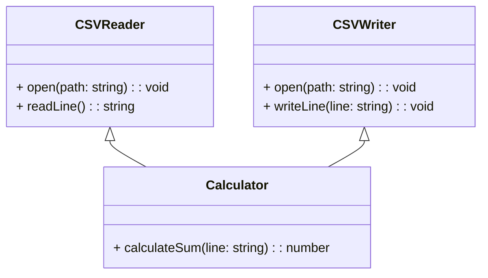

# Software "CSV R&W"

**Requisitos**

- O software deve ler um arquivo no formato CSV.
- Para cada linha, o software deve calcular a soma das duas primeiras colunas.
- O software deve gerar um arquivo CSV, contendo as mesmas linhas do arquivo de entrada, mas com uma coluna adicional que contém a soma obtida para cada linha.

**Design**

O software será composto dos seguintes componentes:

- **Classe `CSVReader`:** responsável por ler o arquivo CSV de entrada.
- **Classe `CSVWriter`:** responsável por gerar o arquivo CSV de saída.
- **Classe `Calculator`:** responsável por calcular a soma das duas primeiras colunas de cada linha.

**Diagrama de classes**

**Implementação**

A implementação do software será realizada em Java, utilizando as seguintes bibliotecas:

- `java.io.FileReader` para leitura de arquivos.
- `java.io.FileWriter` para escrita de arquivos.

**Testes**

O software será testado utilizando os seguintes cenários:

- **Arquivo CSV vazio:** o software deve gerar um arquivo CSV vazio.
- **Arquivo CSV com uma linha:** o software deve gerar um arquivo CSV com uma linha, contendo a soma das duas primeiras colunas da linha original.
- **Arquivo CSV com várias linhas:** o software deve gerar um arquivo CSV com as mesmas linhas do arquivo de entrada, mas com uma coluna adicional que contém a soma obtida para cada linha.
